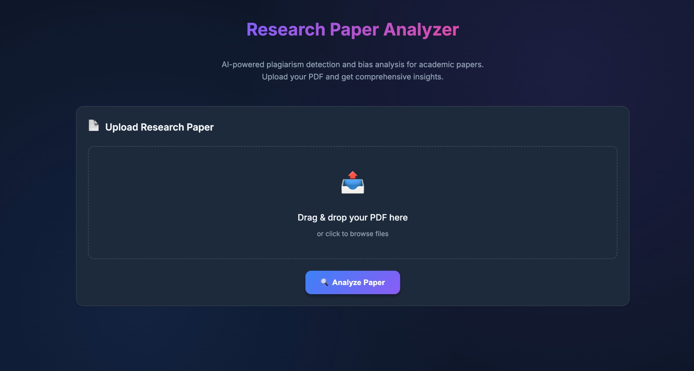
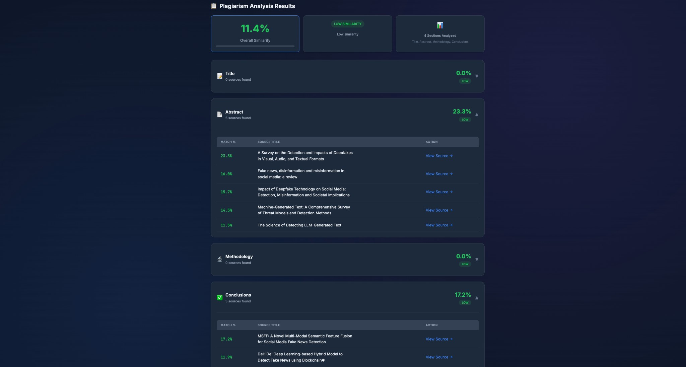
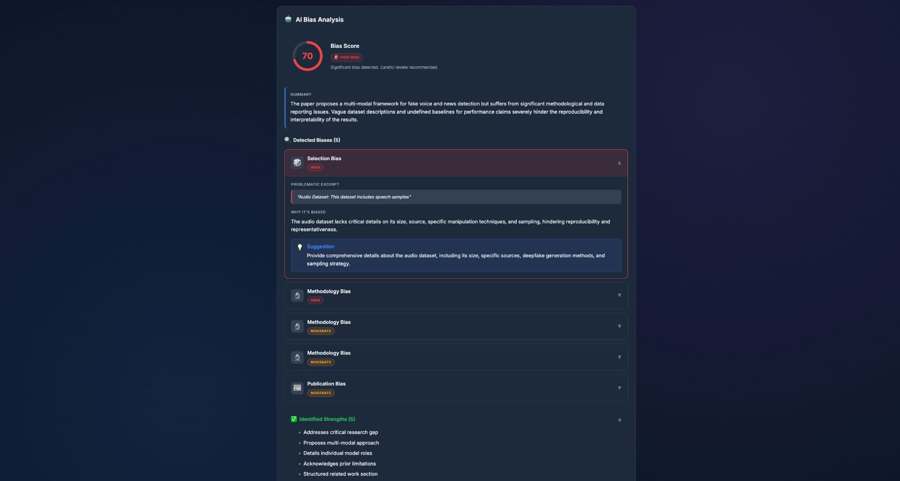

# Research Paper Analyzer

A comprehensive, open-source web tool for analyzing academic papers for plagiarism and bias detection.



## Why This Tool?

### The Problem with Existing Solutions

Academic plagiarism detection is dominated by expensive, proprietary tools that lack critical features researchers actually need:

| Tool | Cost | Bias Detection | Self-Hosted | Academic DBs | Open Source |
|------|------|----------------|-------------|--------------|-------------|
| **Turnitin** | $3+/student/year (institutional only) | No | No | Limited | No |
| **iThenticate** | $125/document | No | No | Yes | No |
| **Grammarly** | $12-30/month | No | No | Limited | No |
| **Copyscape** | $0.03/search | No | No | No (web only) | No |
| **This Tool** | **Free** | **Yes (AI-powered)** | **Yes** | **Yes (3 sources)** | **Yes** |

### What Existing Tools Are Missing

**1. No Bias Detection**
Turnitin, iThenticate, and Grammarly only detect text similarity. They completely ignore academic bias—a critical factor in research integrity. Our tool uses Google's Gemini AI to detect:
- Confirmation bias, Selection bias, Publication bias
- Funding bias, Citation bias, Methodology bias

**2. Prohibitive Pricing**
- Turnitin requires institutional licensing ($10,000+ for universities)
- iThenticate charges **$125 per document**—impractical for students
- Students cannot purchase Turnitin individually

**3. No Data Privacy**
Commercial tools upload your research to their servers. Some index submissions permanently. Our tool is **self-hosted**—your research never leaves your machine.

**4. Limited Transparency**
Proprietary tools are black boxes. You can't verify their algorithms or customize them. Our tool is fully open-source.

**5. No Actionable Feedback**
Traditional tools show similarity percentages without context. We provide:
- Section-by-section analysis (Title, Abstract, Methodology, Conclusions)
- Direct links to matching sources
- AI-generated suggestions for improvement

---

## Project Overview

Research Paper Analyzer is an AI-powered tool that reads academic papers (PDF), extracts main sections, and provides:

1. **Plagiarism Detection**: Evaluates similarity against published academic work from IEEE Xplore, Semantic Scholar, and OpenAlex
2. **AI Bias Analysis**: Detects 6 types of academic bias using Google's Gemini AI with actionable improvement suggestions

## Screenshots

### After Uploading pdf


### Plagiarism Analysis Results


### AI Bias Detection


---

## Features

### Plagiarism Detection
- Extracts text from uploaded PDFs (with robust fallbacks using PyMuPDF, pdfminer, and OCR)
- Splits content into four sections: Title, Abstract, Methodology, Conclusions
- Searches multiple academic databases:
  - **IEEE Xplore** (6M+ documents)
  - **Semantic Scholar** (200M+ papers)
  - **OpenAlex** (250M+ works)
- Computes TF-IDF cosine similarity to estimate overlap
- Classifies similarity levels:
  - 0–25%: Low similarity (mostly original)
  - 25–50%: Moderate similarity
  - >50%: High similarity (review recommended)
- Displays top matching sources with direct links

### AI Bias Analysis
Powered by Google's Gemini AI, detects:
- **Confirmation Bias**: Language assuming conclusions before evidence
- **Selection Bias**: Non-representative sampling indicators
- **Publication Bias**: Overly positive framing, suppressed negative results
- **Funding Bias**: Undisclosed conflicts of interest
- **Citation Bias**: Selective citing supporting predetermined views
- **Methodology Bias**: Flawed experimental design

**Bias Score Classification:**
| Score | Severity | Meaning |
|-------|----------|---------|
| 0-25 | Low | Excellent objectivity |
| 26-50 | Moderate | Some concerns present |
| 51-75 | High | Significant issues detected |
| 76-100 | Severe | Major credibility concerns |

Provides:
- Overall bias score (0-100)
- Detailed explanations for each detected bias
- Actionable suggestions for improvement
- Identified strengths in the paper

---

## Tech Stack

### Backend
- Python 3.9+
- FastAPI
- Google GenAI SDK (Gemini)
- PDF Processing: PyMuPDF, pdfplumber, pdfminer.six, pytesseract
- ML: scikit-learn, numpy, scipy

### Frontend
- React 18 (Vite)
- TypeScript
- Axios
- Modern dark theme UI

---

## Repository Layout

```
backend/
  api.py                     # FastAPI server, POST /analyze endpoint
  requirements.txt           # Python dependencies
  .env                       # Environment variables (API keys)
  .env.example               # Environment template
  src/
    gemini_bias_analyzer.py  # Gemini AI bias detection
    plagiarism_checker.py    # Section extraction, similarity analysis
    text_extraction.py       # PDF text extraction (multi-method)
    integrations/
      ieee_explore.py        # IEEE Xplore API integration

web/
  index.html                 # HTML entry point
  src/
    main.tsx                 # React entry
    ui/
      App.tsx                # Main application UI
      BiasAnalysisSection.tsx # Bias analysis results component
  vite.config.ts             # Vite configuration

assets/                      # Screenshots and images
```

---

## Requirements

### Backend
- Python 3.9+
- Gemini API key (free tier available)
- IEEE Xplore API key (optional, enhances plagiarism detection)

### Frontend
- Node.js 18+
- npm, pnpm, or yarn

---

## Setup & Run

### 1. Clone the Repository

```bash
git clone https://github.com/rk0802p/paper_bias_detection.git
cd paper_bias_detection
```

### 2. Configure Environment Variables

Copy the example environment file and add your API keys:

```bash
cd backend
cp .env.example .env
```

Edit `.env` with your keys:

```env
# Required for bias analysis (free tier available)
GEMINI_API_KEY=your_gemini_api_key_here

# Model selection - Gemini 2.5 Flash recommended
GEMINI_MODEL=gemini-2.5-flash

BIAS_ANALYSIS_ENABLED=true

# Optional - enhances plagiarism detection
IEEE_API_KEY=your_ieee_api_key_here
```

**Available Gemini Models:**
| Model | Speed | Capability | Recommended For |
|-------|-------|------------|-----------------|
| `gemini-2.5-flash` | Fastest | High | Default choice |
| `gemini-2.0-flash` | Fast | High | Stable alternative |
| `gemini-1.5-pro` | Slower | Highest | Complex analysis |

**Get API Keys (Free):**
- Gemini API: https://aistudio.google.com/app/apikey
- IEEE Xplore API: https://developer.ieee.org/

### 3. Start the Backend

```bash
cd backend

# Create virtual environment
python -m venv .venv

# Activate (macOS/Linux)
source .venv/bin/activate
# Activate (Windows)
.venv\Scripts\activate

# Install dependencies
pip install -r requirements.txt

# Start server
uvicorn api:app --reload --port 8000
```

The API will be available at `http://localhost:8000`

### 4. Start the Frontend

```bash
cd web
npm install
npm run dev
```

Open `http://localhost:5173` in your browser.

---

## API Endpoints

### POST /analyze
Upload a PDF file for analysis.

**Request:**
- Content-Type: `multipart/form-data`
- Body: `file` (PDF file)

**Response:**
```json
{
  "plagiarism": {
    "overall_percent": 14.9,
    "overall_category": "Low similarity",
    "sections": {
      "Title": { "best_similarity_percent": 0, "matches": [] },
      "Abstract": { "best_similarity_percent": 32.9, "matches": [...] },
      "Methodology": { "best_similarity_percent": 0, "matches": [] },
      "Conclusions": { "best_similarity_percent": 2.0, "matches": [...] }
    }
  },
  "bias_analysis": {
    "overall_score": 85,
    "severity": "high",
    "summary": "The paper proposes an interesting framework but suffers from significant methodological and reporting biases.",
    "biases": [...],
    "strengths": [...]
  }
}
```

### GET /health
Health check endpoint.

---

## Comparison with Industry Leaders

### vs Turnitin
| Feature | Turnitin | This Tool |
|---------|----------|-----------|
| Price | $10,000+/institution | Free |
| Individual Access | No | Yes |
| Bias Detection | No | Yes |
| Self-Hosted | No | Yes |
| Open Source | No | Yes |
| AI Suggestions | No | Yes |

### vs iThenticate
| Feature | iThenticate | This Tool |
|---------|-------------|-----------|
| Price | $125/document | Free |
| Bias Detection | No | Yes |
| Real-time Analysis | No | Yes |
| Section Analysis | No | Yes |
| Improvement Tips | No | Yes |

### vs Grammarly
| Feature | Grammarly | This Tool |
|---------|-----------|-----------|
| Academic Focus | Limited | Full |
| Scholarly Databases | ProQuest only | IEEE, Semantic Scholar, OpenAlex |
| Bias Detection | No | Yes |
| Self-Hosted | No | Yes |
| Research Integrity | Grammar focus | Plagiarism + Bias |

---

## Use Cases

- **Students**: Check papers before submission without institutional access
- **Researchers**: Verify originality and identify potential bias before peer review
- **Institutions**: Self-hosted solution with complete data privacy
- **Journals**: Pre-screen submissions for integrity issues

---

## Notes & Limitations

- Similarity scores are approximate signals for manual review, not legal plagiarism determinations
- Bias analysis quality depends on Gemini AI model and API availability
- For scanned/image PDFs, OCR support requires tesseract installed on the system
- IEEE Xplore results require a valid API key

---

## Contributing

Contributions are welcome! Please feel free to submit a Pull Request.
